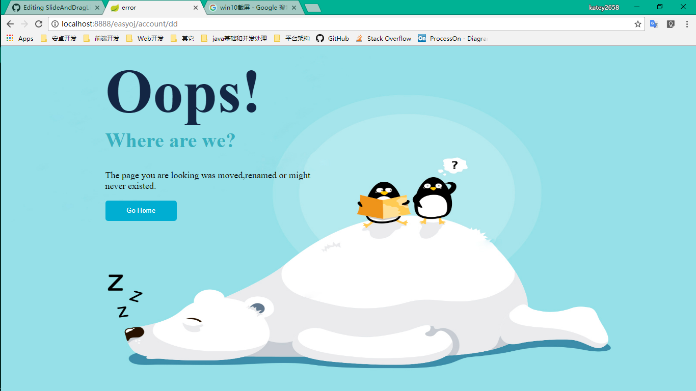

##EasyOJ 
#### 项目描述
easyoj是关于构建现代化在线教育和学习系统的一个规划项目。
围绕着这个规划将产生最终四个独立的系统：
1. mooc系统:
这个系统主要提供基础课程信息的搜索和查看，并提供基本课程的视频或者文字服务。
2. oj系统：
这个系统主要提供课程阶段性和最终的课程评测。
3. 在线通讯系统：
提供课程中学生和教师以及学生之间的通讯和交流，以及对于课程问题的讨论。
4. 用户系统：
系统提供基本的用户服务，包括用户空间和基本的登录注册服务。
5. 提供商管理系统：
系统是为课程提供商提供一个可视化的操作界面，提供课程的发布，上传等。

#### 技术描述

系统采用`Spring`+`SpringMVC`+`Mybatis`的主要框架；
使用`redis`集群做缓存；
采用`thymeleaf`来做视图模板的渲染；
数据库采用`mysql`,并采用主从分离的架构来提高容灾性。
系统间将用`hession`进行通讯，和服务的访问。

----------------------
#### Mooc系统模块划分
> 模块根据功能划分为基础功能，业务功能，拓展服务
##### 基础功能
- 登录服务
- 注册服务
- 找回密码服务
- 验证码服务
##### 业务功能
- 课程信息服务
- 搜索服务
- 视频服务
- 课程评价服务
##### 拓展功能
- 课程笔记服务
- 用户分享服务

#### 页面描述
##### 登录页面

##### 注册页面

##### 错误页面

